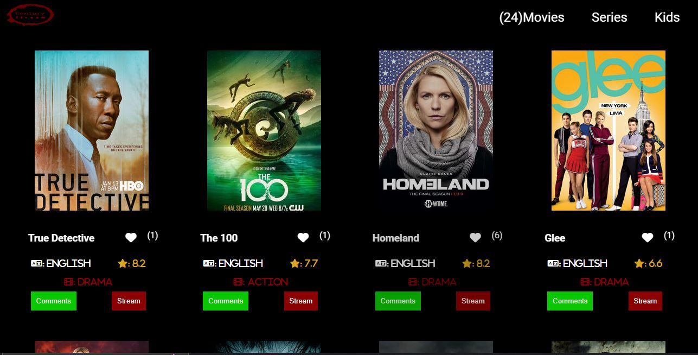
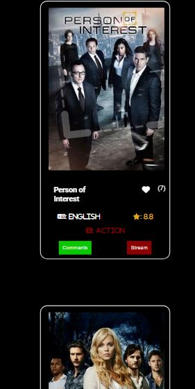

# Project Name

> This JavaScript capstone project is built on the [TVMAZE API](https://static.tvmaze.com/apidoc/), an external API. The cards display the movies information that was retrieved from the API. The user has the option to like and comment on the movies cards.





## Built With

- HTML, CSS, JavaScript, and Tv-Maze API

## Live Demo (if available)

[Live Demo Link](https://natanima.github.io/Javascript-capstone-project/)

## Getting Started


To get a local copy up and running follow these simple example steps.


```
git clone https://github.com/NatanimA/Javascript-capstone-project.git
```

```
npm install
```

```
npm run build
```

Lastly

```
npm start
```

😉 

### Prerequisites
- Vscode
- nodeJs
- webpack

### Run tests

To Test it follow this steps

Please make sure to download the dependencies first
```
npm install --save-dev jest
```
JS-DOM is needed as well
```
npm install -D jest-environment-jsdom
```
Lastly

```
npm test
```

## Authors

👤 Natanim Abesha

- GitHub: [@githubhandle](https://github.com/NatanimA)
- Twitter: [@twitterhandle](https://twitter.com/Natanim_)
- LinkedIn: [LinkedIn](https://www.linkedin.com/in/natanim-abesha-04a39823a/)

👤 Ashwin Carvalho

- GitHub: [@AshwinCarvalho999 ](https://github.com/AshwinCarvalho999)
- LinkedIn: [ashwin-carvalho ](https://www.linkedin.com/in/ashwin-carvalho-5426701b1/)
- Twitter: [https://twitter.com ](https://twitter.com)

## 🤝 Contributing

Contributions, issues, and feature requests are welcome!

Feel free to check the [issues page](../../issues/).

## Show your support

Give a ⭐️ if you like this project!

## Acknowledgments

- Hat tip to anyone whose code was used
- Inspiration
- etc

## 📝 License

This project is [MIT](./LICENSE) licensed.
